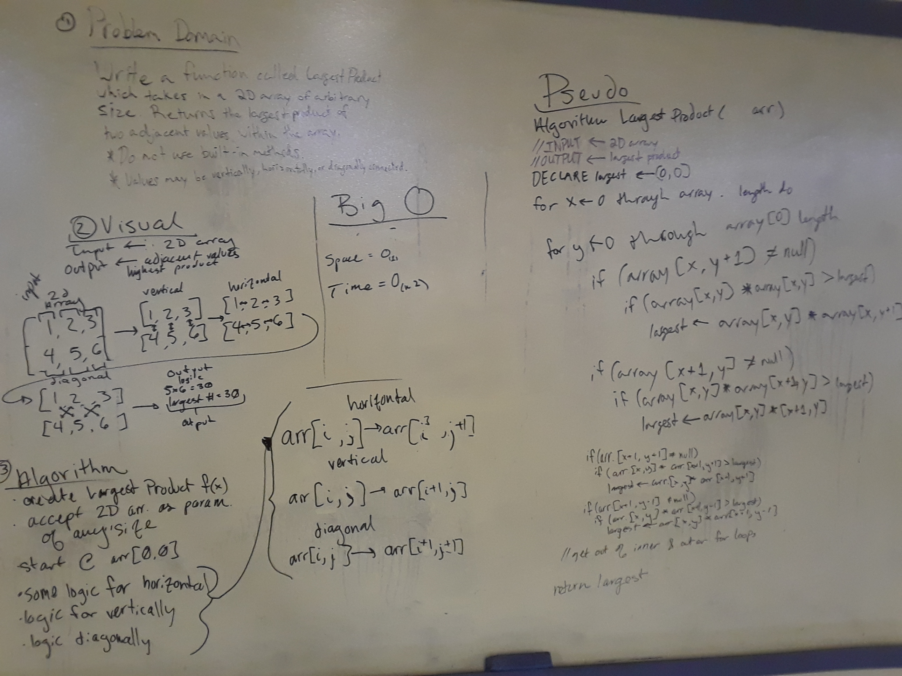
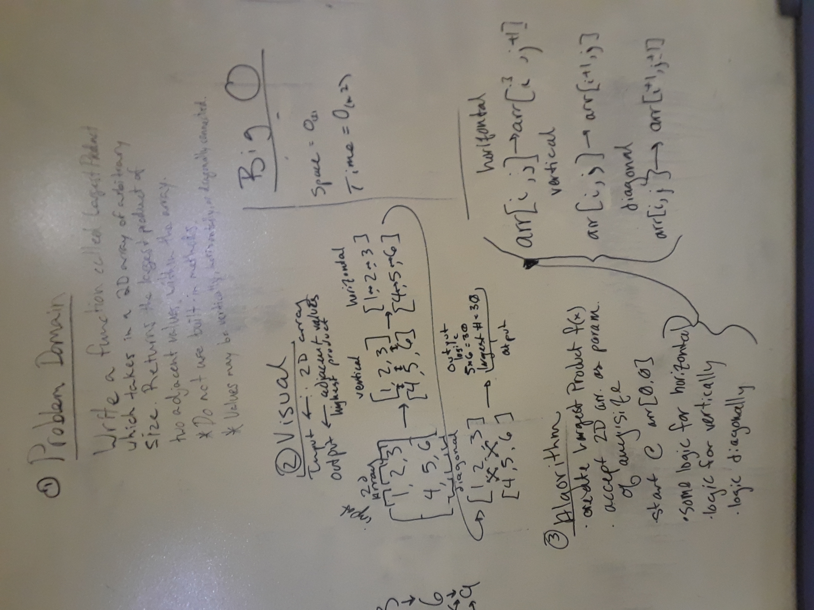
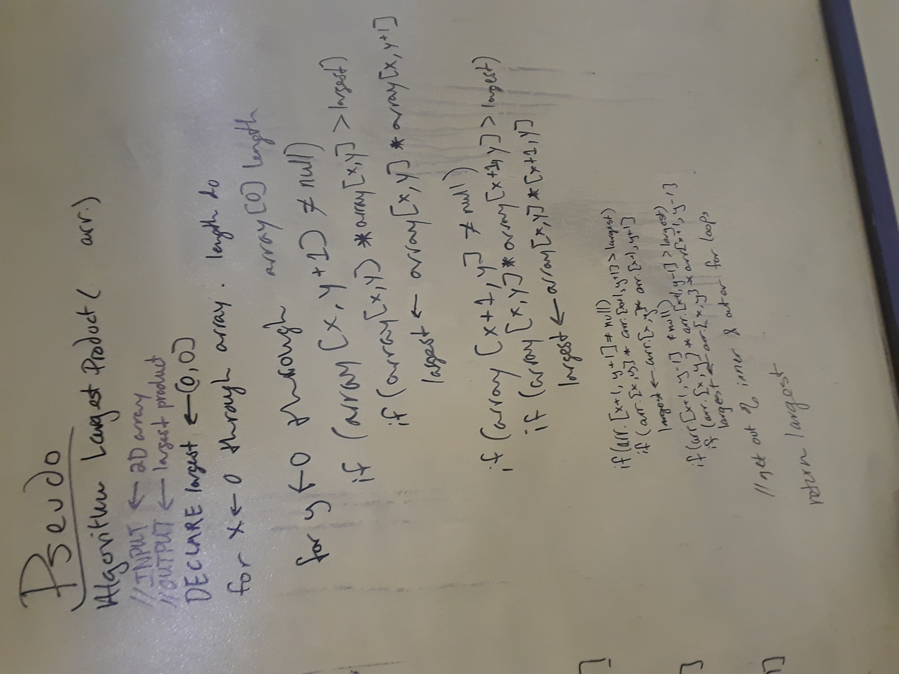

# Adjacent Product
An application which calculates the largest product of two adjacent elements from a two-dimensional array.
The application employs exception handling to deal with potential empty arrays.

## Challenge
Write a function which takes in a 2D array, of arbitrary size.
Without utilizing any of the built-in methods available to your language, return the largest product of 2 adjacent values within the 2D array.
* Adjacent values might be horizontally, vertically, or diagonally connected.

## Solution

