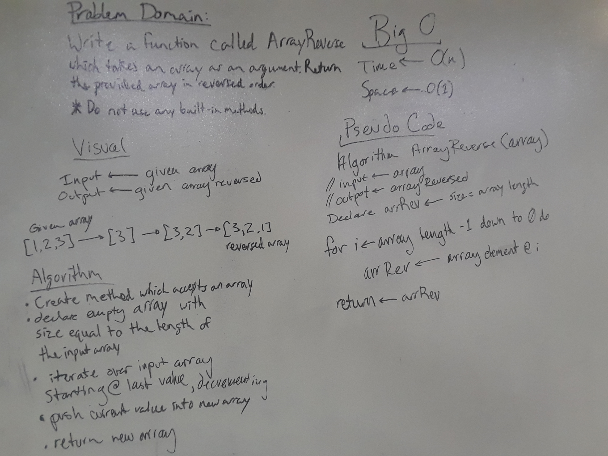

# Reverse an Array
An application which reverses an array of numbers. The reversed array is then printed to the Console window.

## Challenge
Write a function called reverseArray which takes an array as an argument.
Without utilizing any of the built-in methods available to your language, return the provided array argument with elements in reversed order.

## Solution

I solved the problem utilizing a for loop to iterate over the array argument, returning the reversed array to a variable in Main for later use.
Once the reversed array is stored in a variable in Main, I implemented another function to iterate over this data, and print each element to the Console.