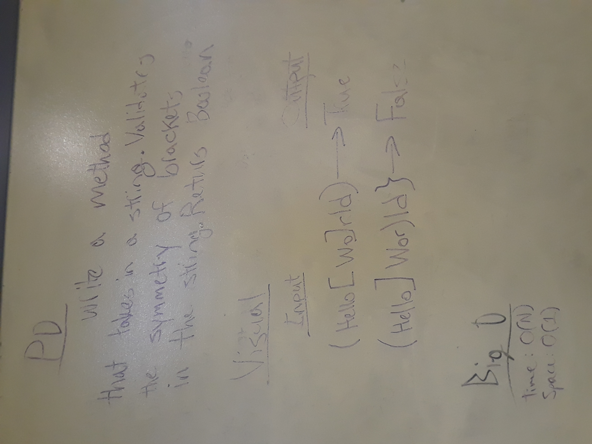
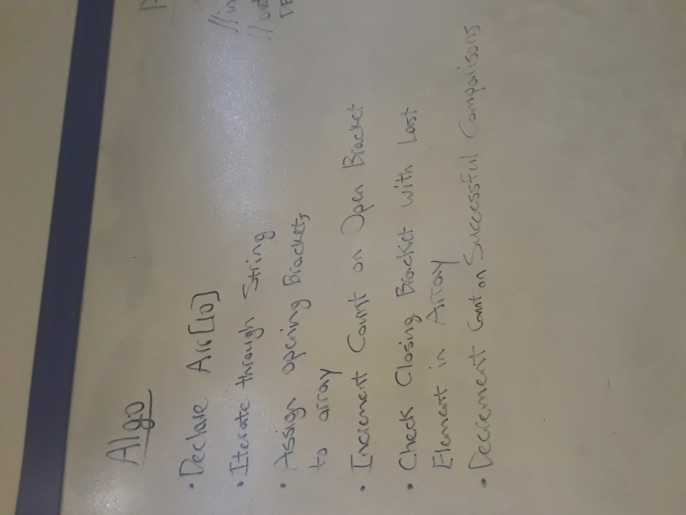
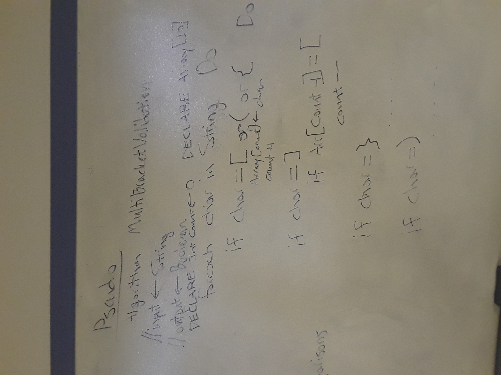

# Bracket Validation
.Net Console application which checks an input string to determine if the brackets in the string are balanced.

## Challenge

Write a function which takes a string as its only argument, and should return a boolean representing whether or not
the brackets in the string are balanced.

There are 3 types of brackets:
* Round Brackets : ()
* Square Brackets : []
* Curly Brackets : {}

## Examples

* {}						TRUE
* {}(){}					TRUE
* ()[[Extra Characters]]	TRUE
* (){}[[]]					TRUE
* {}{Extra}[Characters](())	TRUE
* [({}]						FALSE
* (](						FALSE

## Solution

I solved this challenge by utilizing a Stack to store the opening brackets ( [, (, { ) in the input string.
The Stack is then checked any time a closing bracket ( ], ), } ) appears in the string. If the opening bracket
at the top of the Stack and the closing bracket in the string corresponde to one another, the opening bracket
is popped off of the Stack. If the two brackets don't correspond to each other, the method returns false.
False is also returned if the Stack still contains opening brackets after looping through the entire string,
or if a closing bracket occurs when nothing is currently being stored in the Stack.