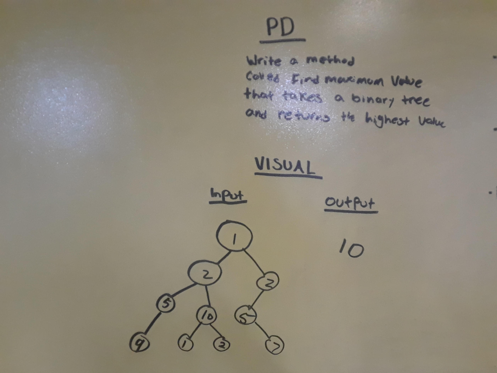

# Find the Maximum Value in a Binary Tree
An application which locates the highest integer value from a Binary Tree.

## Challenge
Write a function called find-maximum-value which takes the Root of a Binary Tree as its only input.
Without utilizing any of the built-in methods, return the maximum value stored in the tree.
* You can assume that the values stored in the Binary Tree will be numeric.

## Solution

