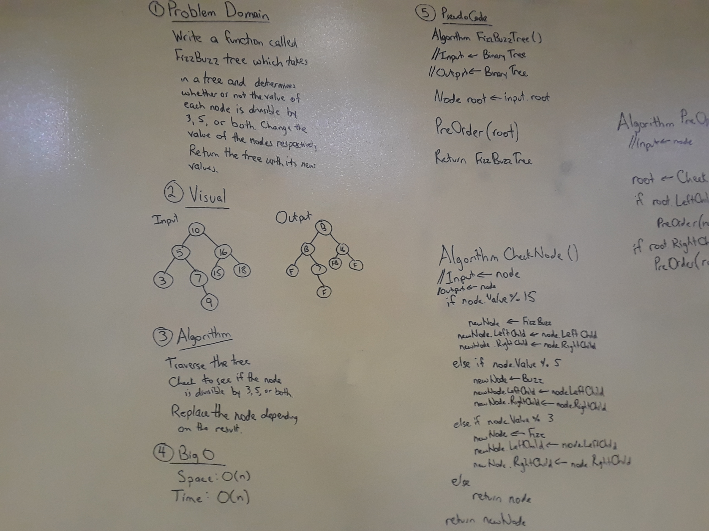

# FizzBuzz Tree
An application which converts the Values of Nodes within a Binary Tree to the respective "FizzBuzz" value,
based on whether the Node's Value is divisible by 3, 5, or both.

## Challenge
Write a function called FizzBuzzTree which takes the Root of a Binary Tree as an argument.
Without utilizing any built-in methods, determine weather or not the value of each node
is divisible by 3, 5 or both, and change the Value of each of the Nodes respectively.

## Solution

I solved this challenge by creating two methods (one being a helper method) to iterate through the
Binary Tree and check the Value of each Node, converting the Value to the corresponding FizzBuzz value
if it was divisible by 3, 5, or both.