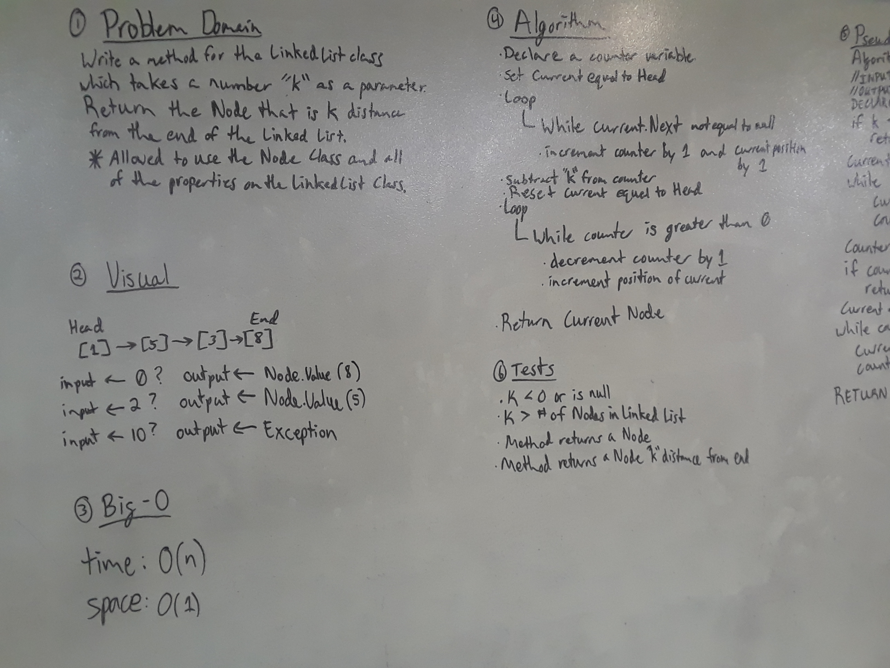

# Linked List Kth Element From End
An application which allows users to enter a number, "k", and discover the Node that is
"k" distance from the end of a Linked List.

## Challenge
Write a method for the Linked List class which takes a number, k, as a parameter.
Return the node that is k from the end of the linked list.
* You have access to the Node class and all the properties on the Linked List class.

## Solution

I solved this solution by utilizing a counter variable and two while loops. I later refactored this
solution to instead use a "Runner" which iterates through the Linked List "k" distance ahead of the
"Current" Node. Once the Runner reaches the end of the Linked List, the Current Node is returned.

An IndexOutOfRangeException is thrown if "k" is either negative or greater than the length of the Linked List.