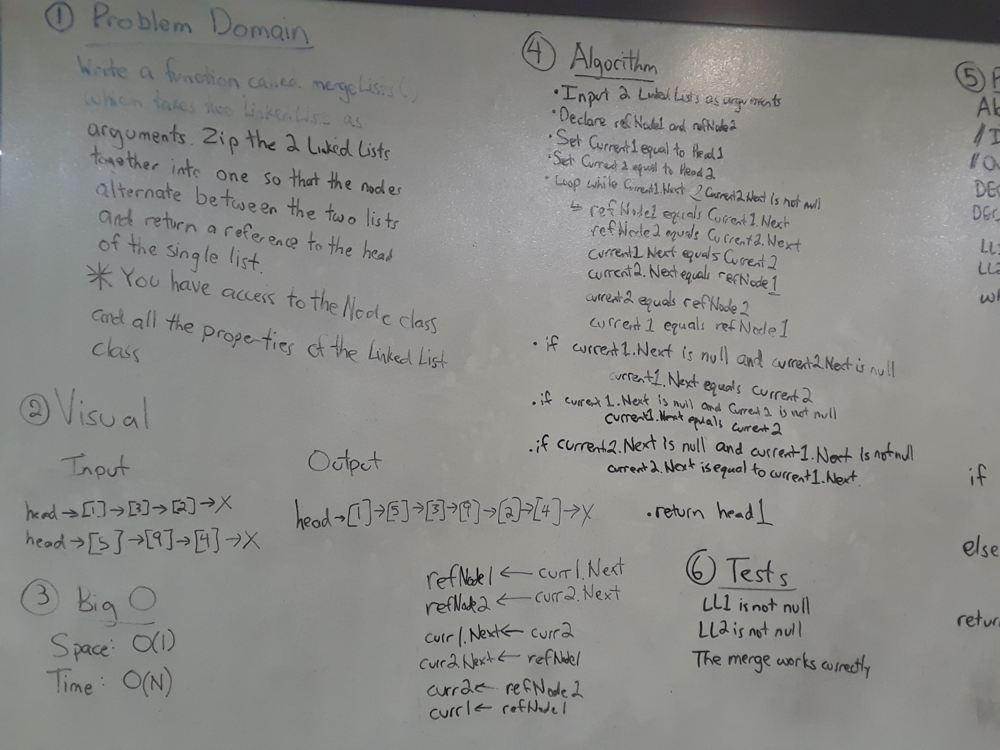
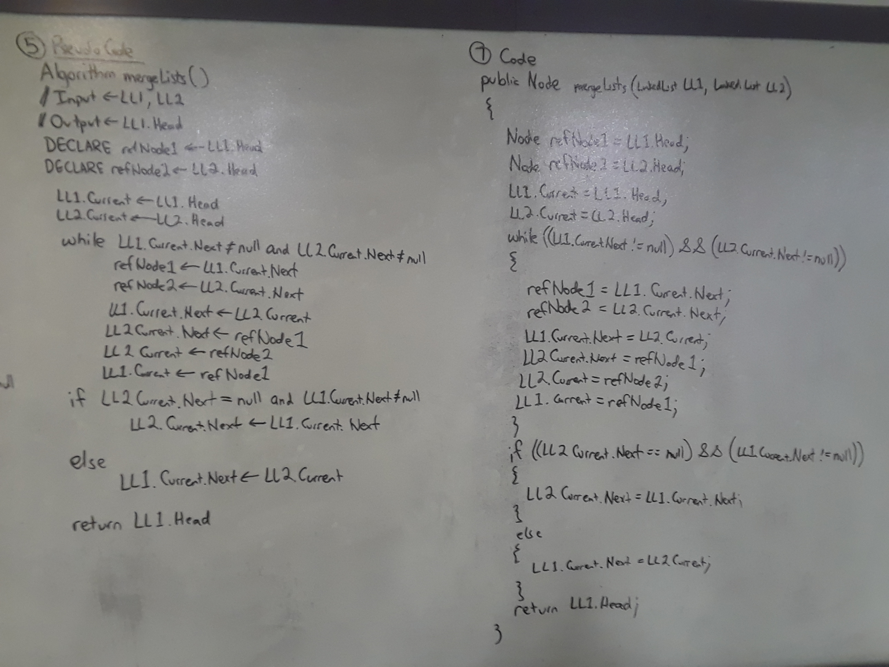

# Linked List Merge
An application which creates two Linked Lists, and then merges them together into the first Linked List.
Nodes alternate after merge between first and second Linked Lists.

Post Merge:
[LL1 Node] --> [LL2 Node] --> [LL1 Node] --> [LL2 Node]... etc.

## Challenge
Write a function which takes two linked lists as arguments.
Zip the two linked lists together into one so that the nodes alternate
between the two lists and return a reference to the head of the single list.
* You have access to the Node class and all the properties on the Linked List class.
* Keep space to O(1)

## Solution

