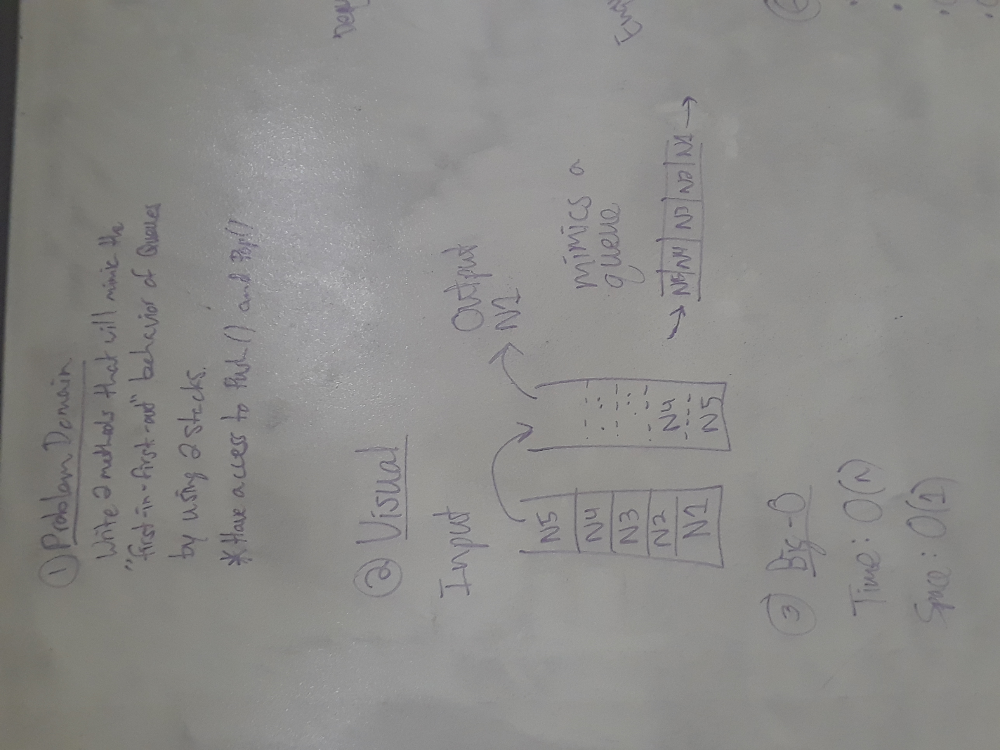
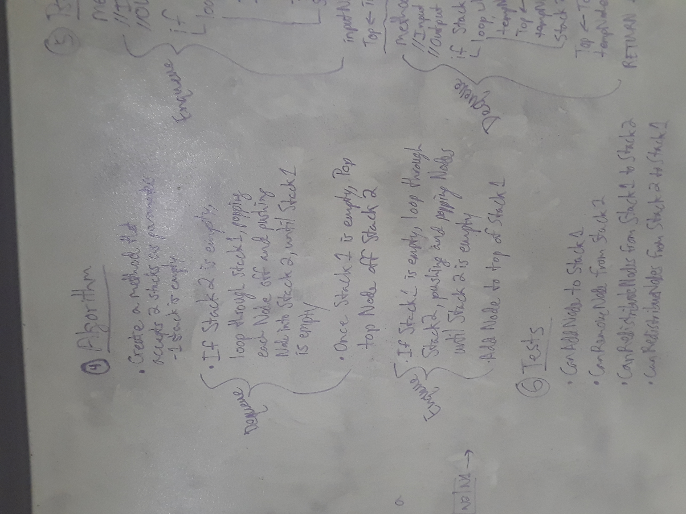
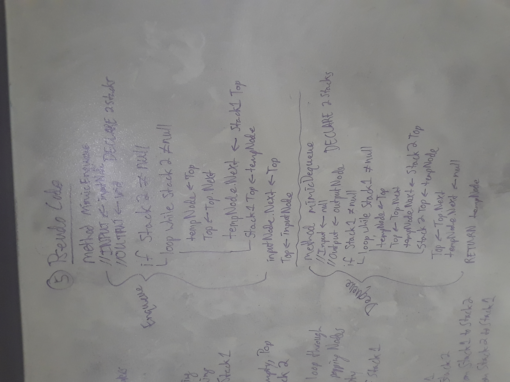

# Queue with Stacks

.Net Console application which utilizes 2 Stacks to perform the Enqueue and Dequeue functionality of a Queue.

## Challenge

Write 2 methods that will perform the "first-in-first-out" behavior of a Queue by using 2 Stacks.

## Solution

