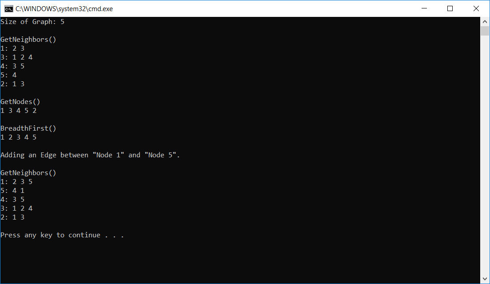

# Graphs

.Net Console application which demonstrates the functionality of Graphs.

## Description and Uses

Graphs comprise of a collection of Vertices (Nodes) which are typically linked by Edges which can either
be implemented in a Directed or Undirected fashion, and which often contain additional values such as a "weight" or "cost".

* Example 1: Social media applications utilize Undirected Graphs to track connections ("friends") between users,
             allowing the site to suggest other users to connect with based on existing connections.
* Example 2: Airliners and Travel Agencies can use Directed Graphs to coordinate flights and suggest
             the lowest cost or fastest flight itineraries to users based on the "cost" of an Edge connection.

## Challenge

Implement a Graph as an adjacency list, which implements the following:

* AddEdge() - Adds a new vertice to the graph
* GetNodes() - Returns all of the nodes in the graph as a collection
* GetNeighbors() - Returns a collection of nodes connected to the given node
* Size() - Returns the total number of nodes in the graph
* BreadthFirst() - Takes in a root node, and returns a collection of all the nodes visited in order

## Functional Images

