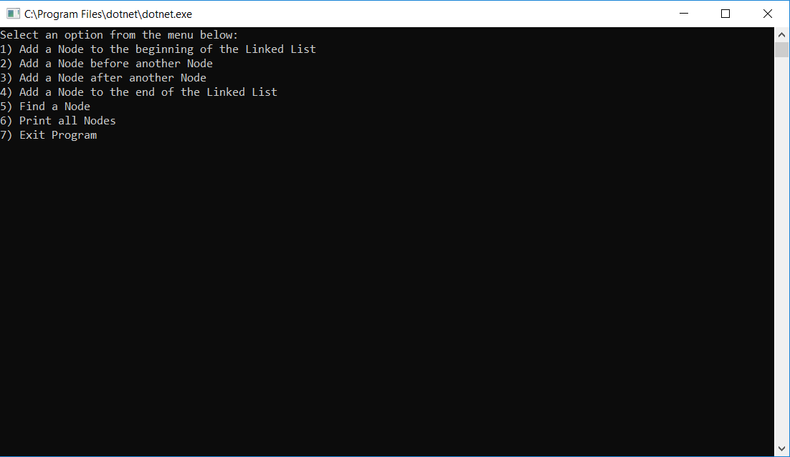
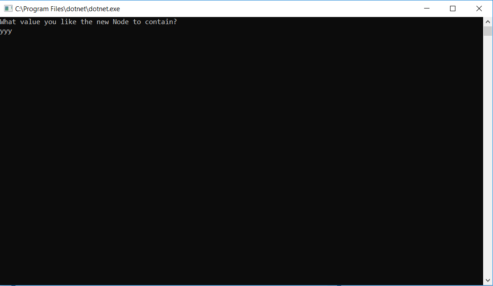
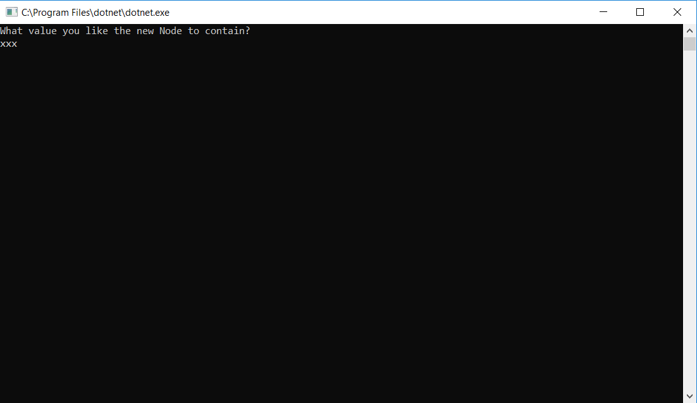
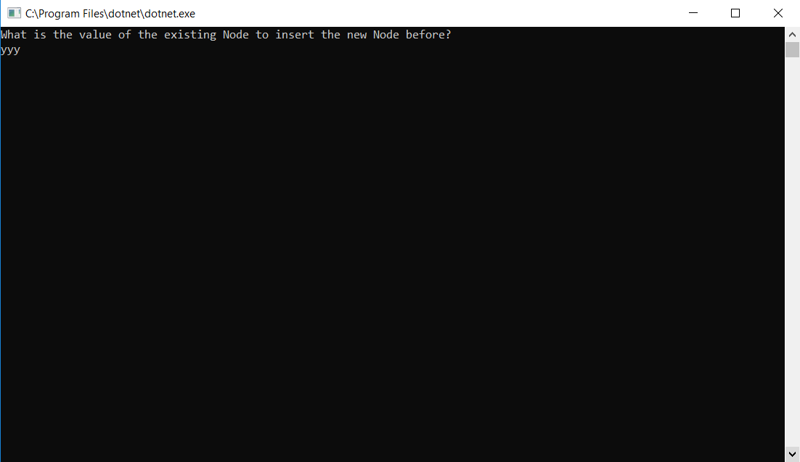
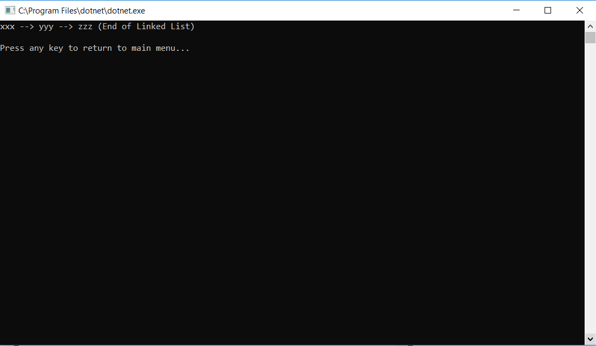

# Linked Lists
An application which allows the user to manipulate Nodes in a Linked List.

## Challenge
Demonstrate various ways to manipulate a Listed List, to show the O(n) efficiencies of different operations.
* O(1) - Add a node to the front of the linked list
* O(n) - Find a specific value in the linked list
* O(n) - Print out all of the values in the linked list
* O(n) - Add a node before an existing node.
* O(n) - Add a node after an existing node
* O(n) - Add a node to the end of a linked list.

## Solution

