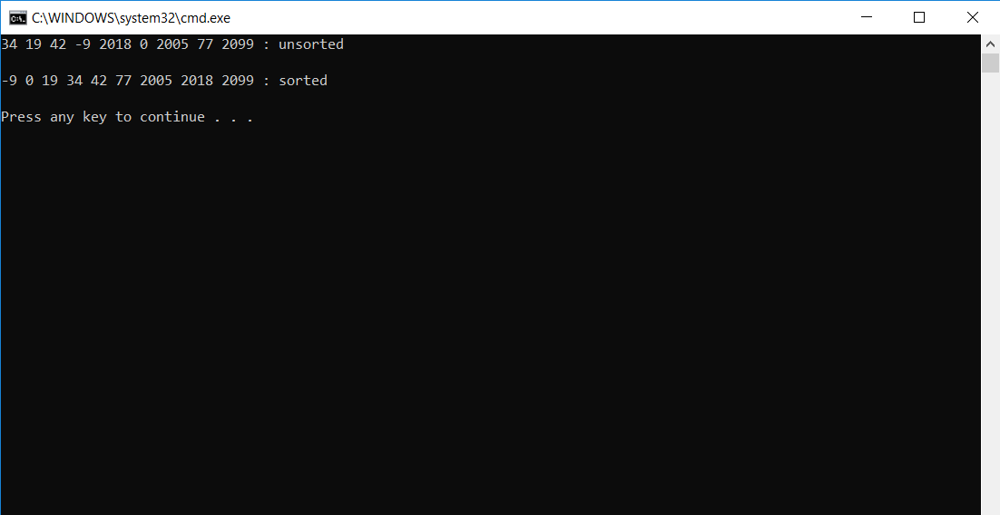

# Merge Sort

An application demonstrating the implementation of an merge sorting algorithm on an integer array.

## Challenge

Write a function that accepts an array of unsorted integers, and returns a sorted array by a recursive mergesort algorithm.

## Functional Images

Merge sorting algorithms work by reducing the number of elements in the array, often recursively,
and then sorting the array elements as the final array is rebuilt. This is done so that it only
has to compare two sets of integers at a time. The worst-case efficiency for a merge sort is O(n log n).