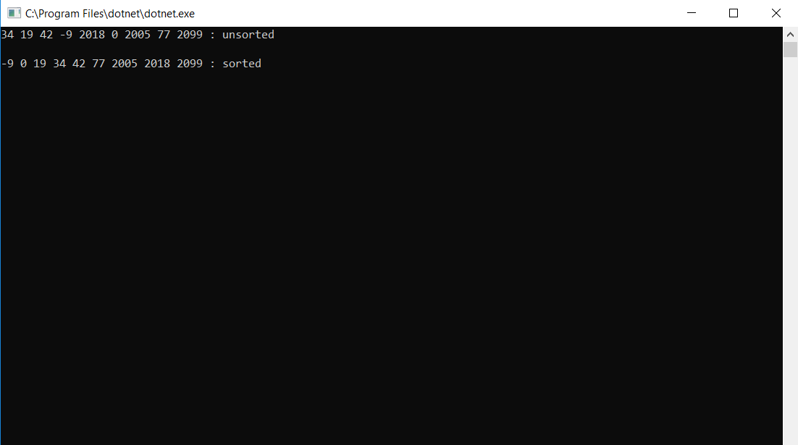

# Quick Sort

An application demonstrating the implementation of an quick sorting algorithm on an integer array.

## Challenge

Write a function that accepts an array of integers, and returns an array sorted by a recursive quicksort algorithm.

## Functional Images

Quick sorting algorithms work by finding a "pivot" element in an integer array (typically the first, middle, last, or random index).
After locating a pivot element, the array is iterated over, swapping elements across the partition defined by the pivot element,
so that by the end of the iteration, all elements smaller than the pivot are on the left and all elements larger than the pivot are
on the right. This is done recursively, narrowing the partitions made until all elements are in the correct, sorted order.
Typical efficiency for a quick sort is O(n log n), but depending on the pivot element, an array that is already partially or fully
sorted can reduce the efficiency to O(n2).