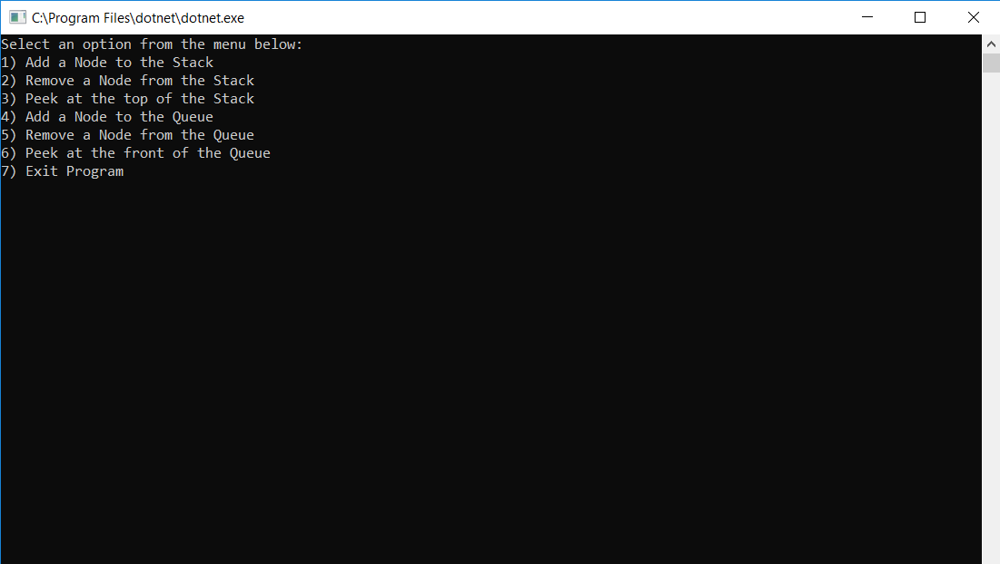
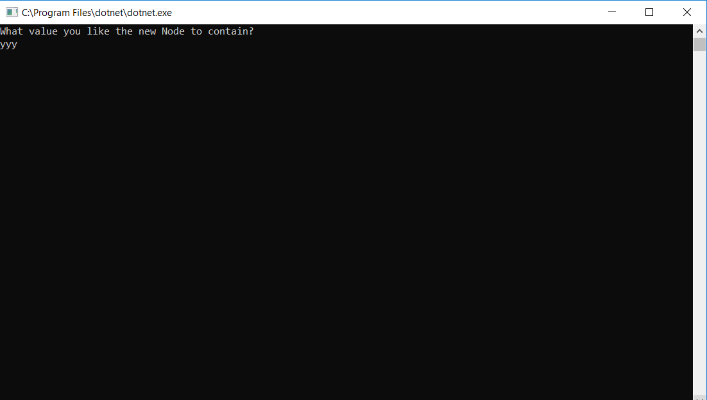
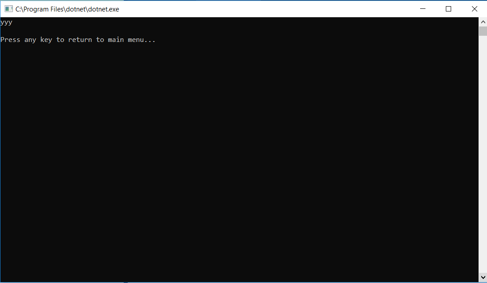

# Stack and Queue

.Net Console application which demonstrates the functionality of Stacks and Queues.

## Challenge

Demonstrate various ways to manipulate Stacks and Queues.
* O(1) - Pushing a node onto your stack.
* O(1) - Popping a node off your stack.
* O(1) - Peeking at the top node of your stack.
* O(1) - Enqueue a node into your queue.
* O(1) - Dequeue a node off of your queue.
* O(1) - Peek at the front of your queue.

## Functional Images

