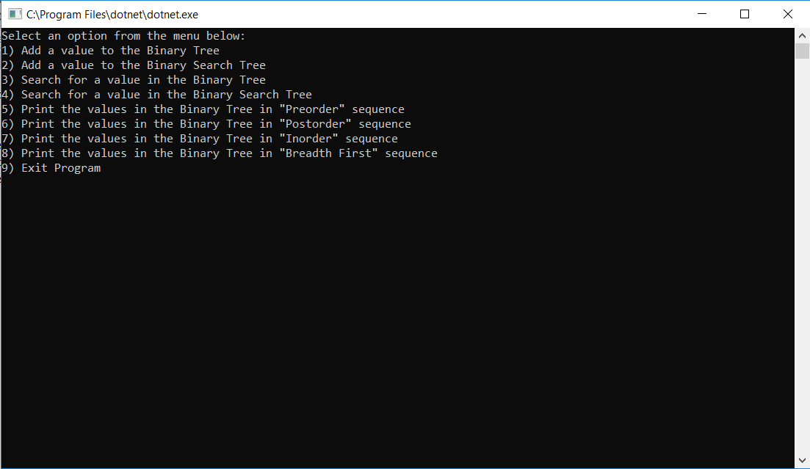
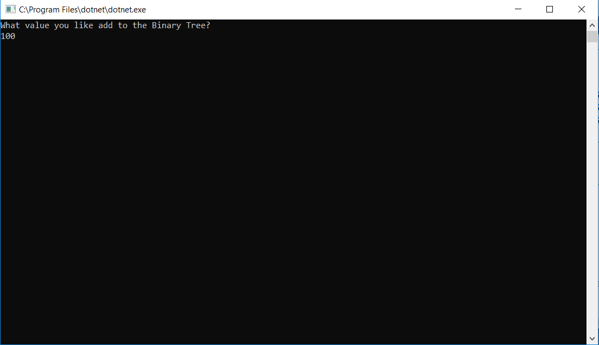
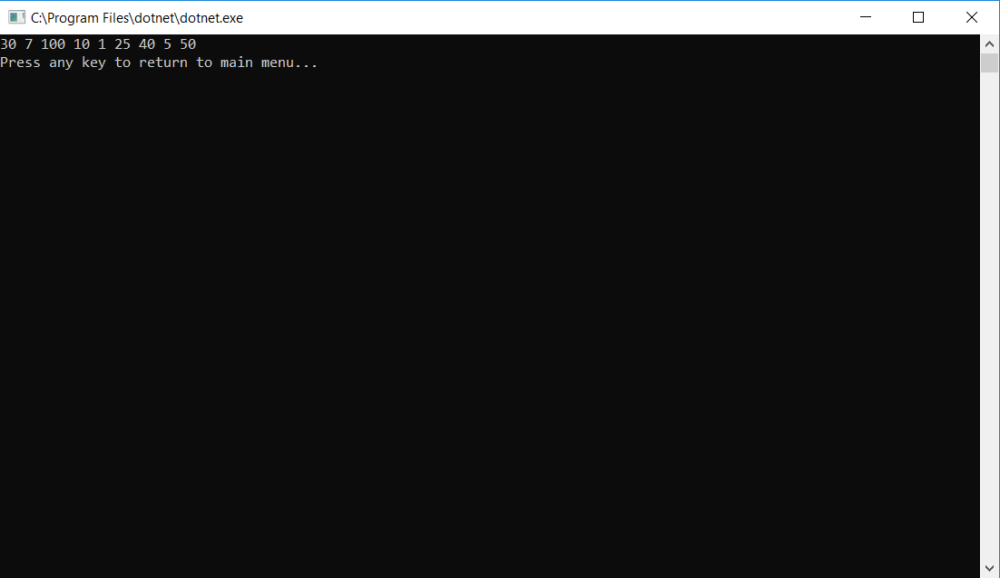

# Trees

.Net Console application which demonstrates the functionality of Binary Trees and Binary Search Trees.

## Challenge

Create a Binary Tree Class with the following functionality:
* PreOrder() - Print: Root, Left, Right
* InOrder() - Print: Left, Root, Right
* PostOrder() - Print: Left, Right, Root
* BreadthFirst() - Print: Each level of the Tree node by node
* Search()
* Add a Node()

Create a Binary Search Tree Class with the following functionality:
* Search()
* Add a Node()

## Functional Images

